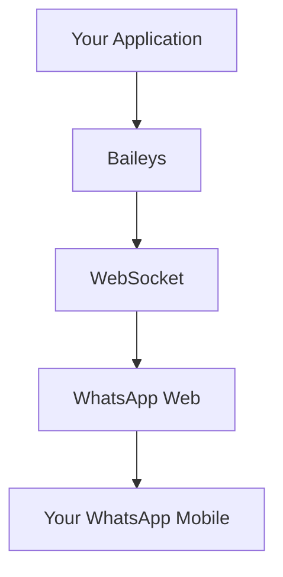

# 🚀 Baileys - Complete and Didactic Guide

<div align='center'>


**The most complete WhatsApp Web API in TypeScript/JavaScript**

[](https://github.com/brunocgc/Baileys)
[](https://www.npmjs.com/package/@brunocgc/baileys)

</div>

---

## 📋 Table of Contents

- [🎯 What is Baileys?](#-what-is-baileys)
- [⚡ Quick Start](#-quick-start)
- [🔧 Detailed Installation](#-detailed-installation)
- [🏗️ Basic Configuration](#️-basic-configuration)
- [📱 Connecting Your Account](#-connecting-your-account)
- [📨 Sending Messages](#-sending-messages)
- [🎯 Practical Use Cases](#-practical-use-cases)
- [🛠️ Advanced Configuration](#️-advanced-configuration)
- [🔍 Troubleshooting](#-troubleshooting)
- [📚 Additional Resources](#-additional-resources)

---

## 🎯 What is Baileys?

**Baileys** is a JavaScript/TypeScript library that allows you to interact with WhatsApp Web programmatically, without needing Selenium or heavy browsers.

### ✨ Main Advantages

- 🚫 **No Selenium**: Direct connection via WebSocket
- 💾 **RAM Saving**: ~500MB less memory usage
- 🔄 **Multi-device**: Full support for WhatsApp Multi-Device
- 📱 **QR Code or Code**: Two authentication methods
- 🔒 **Secure**: Complete implementation of Signal protocol

### 🏗️ Architecture



---

## ⚡ Quick Start

### 1️⃣ Installation

```bash
# NPM
npm install @brunocgc/baileys

# Yarn
yarn add @brunocgc/baileys

# PNPM
pnpm add @brunocgc/baileys
```

### 2️⃣ First Code

```typescript
import makeWASocket, { DisconnectReason, useMultiFileAuthState } from '@brunocgc/baileys'

async function startBot() {
    // 1. Configure authentication
    const { state, saveCreds } = await useMultiFileAuthState('auth_info')

    // 2. Create connection
    const sock = makeWASocket({
        auth: state,
        printQRInTerminal: true
    })

    // 3. Save credentials
    sock.ev.on('creds.update', saveCreds)

    // 4. Listen to messages
    sock.ev.on('messages.upsert', ({ messages }) => {
        const msg = messages[0]
        if (!msg.key.fromMe && msg.message) {
            console.log('New message:', msg.message)

            // Auto reply
            sock.sendMessage(msg.key.remoteJid!, {
                text: 'Hello! I am a bot made with Baileys!'
            })
        }
    })
}

startBot()
```

### 3️⃣ Run

```bash
npx ts-node my-bot.ts
```

**📱 Scan the QR Code that will appear in the terminal with your WhatsApp!**

---

## 🔧 Detailed Installation

### 📦 Package Managers

<details>
<summary><strong>NPM (Node Package Manager)</strong></summary>

```bash
# Stable version
npm install @brunocgc/baileys

# Development version (latest features)
npm install github:brunocgc/Baileys
```

</details>

<details>
<summary><strong>Yarn</strong></summary>

```bash
# Stable version
yarn add @brunocgc/baileys

# Development version
yarn add github:brunocgc/Baileys
```

</details>

<details>
<summary><strong>PNPM</strong></summary>

```bash
# Stable version
pnpm add @brunocgc/baileys

# Development version
pnpm add github:brunocgc/Baileys
```

</details>

### 🔧 Optional Dependencies

For extra features, install:

```bash
# For automatic thumbnails
npm install sharp
# or
npm install jimp

# For link previews
npm install link-preview-js

# For cache (recommended for groups)
npm install node-cache
```

---

## 🏗️ Basic Configuration

### 🎛️ Socket Options

```typescript
import makeWASocket, { Browsers } from '@brunocgc/baileys'

const sock = makeWASocket({
    // 🔐 Authentication
    auth: state,

    // 📱 QR Code in terminal
    printQRInTerminal: true,

    // 🌐 Browser (affects message history)
    browser: Browsers.macOS('My Bot'),

    // 📚 Sync full history
    syncFullHistory: true,

    // 🔕 Don't mark as online automatically
    markOnlineOnConnect: false,

    // 📊 Custom logger
    logger: pino({ level: 'info' })
})
```

### 🎯 Recommended Settings

<details>
<summary><strong>For Production Bots</strong></summary>

```typescript
const sock = makeWASocket({
    auth: state,
    browser: Browsers.ubuntu('MyBot'),
    markOnlineOnConnect: false,
    syncFullHistory: false,
    generateHighQualityLinkPreview: true,

    // Cache for groups (improves performance)
    cachedGroupMetadata: async (jid) => groupCache.get(jid),

    // Store for message retry
    getMessage: async (key) => await getMessageFromStore(key)
})
```

</details>

<details>
<summary><strong>For Development</strong></summary>

```typescript
const sock = makeWASocket({
    auth: state,
    printQRInTerminal: true,
    logger: pino({ level: 'debug' }),
    browser: Browsers.macOS('Debug'),
    syncFullHistory: true
})
```

</details>

---

## 📱 Connecting Your Account

### 🔍 Method 1: QR Code (Recommended)

```typescript
import makeWASocket from '@brunocgc/baileys'

const sock = makeWASocket({
    printQRInTerminal: true,
    browser: Browsers.ubuntu('My App')
})

console.log('📱 Scan the QR Code above with your WhatsApp!')
```

**✅ Advantages**: More stable, always works
**❌ Disadvantages**: Need to scan manually

### 📞 Method 2: Pairing Code

```typescript
import makeWASocket from '@brunocgc/baileys'

const sock = makeWASocket({
    printQRInTerminal: false
})

// ⏳ Wait for QR event before requesting code
sock.ev.on('connection.update', async (update) => {
    if (update.qr && !sock.authState.creds.registered) {
        const phoneNumber = '5511999999999' // Your number with country code
        const code = await sock.requestPairingCode(phoneNumber)
        console.log(`🔢 Pairing code: ${code}`)
        console.log('📱 Enter this code in your WhatsApp')
    }
})
```

**✅ Advantages**: No need to scan QR
**❌ Disadvantages**: Only works once per number

### 🔄 Connection Management

```typescript
import { Boom } from '@hapi/boom'

sock.ev.on('connection.update', (update) => {
    const { connection, lastDisconnect } = update

    if (connection === 'close') {
        const shouldReconnect = (lastDisconnect?.error as Boom)?.output?.statusCode !== DisconnectReason.loggedOut

        if (shouldReconnect) {
            console.log('🔄 Reconnecting...')
            startBot() // Function that starts the bot
        } else {
            console.log('🚪 Disconnected. Scan QR again.')
        }
    } else if (connection === 'open') {
        console.log('✅ Connected successfully!')
    }
})
```

---

## 📨 Sending Messages

### 💬 Text Messages

```typescript
// Simple message
await sock.sendMessage(jid, { text: 'Hello! 👋' })

// With formatting
await sock.sendMessage(jid, {
    text: '*Bold* _Italic_ ~Strikethrough~ ```Code```'
})

// Mention
await sock.sendMessage(jid, {
    text: '@5511999999999 Hello!',
    mentions: ['5511999999999@s.whatsapp.net']
})
```

### 🖼️ Media Messages

<details>
<summary><strong>📷 Images</strong></summary>

```typescript
import fs from 'fs'

// From local file
await sock.sendMessage(jid, {
    image: fs.readFileSync('./image.jpg'),
    caption: 'Check this photo! 📸'
})

// From URL
await sock.sendMessage(jid, {
    image: { url: 'https://example.com/image.jpg' },
    caption: 'Image from internet 🌐'
})

// ViewOnce (single view)
await sock.sendMessage(jid, {
    image: { url: './photo.jpg' },
    viewOnce: true,
    caption: 'This photo self-destructs! 💥'
})
```

</details>

<details>
<summary><strong>🎥 Videos</strong></summary>

```typescript
// Normal video
await sock.sendMessage(jid, {
    video: fs.readFileSync('./video.mp4'),
    caption: 'Check this video! 🎬'
})

// Video note (PTV)
await sock.sendMessage(jid, {
    video: { url: './video.mp4' },
    ptv: true // Personal Video Message
})

// GIF (actually MP4 with flag)
await sock.sendMessage(jid, {
    video: fs.readFileSync('./animation.mp4'),
    gifPlayback: true,
    caption: 'Animated GIF! 🎭'
})
```

</details>

<details>
<summary><strong>🎵 Audio</strong></summary>

```typescript
// Normal audio
await sock.sendMessage(jid, {
    audio: { url: './audio.mp3' },
    mimetype: 'audio/mp4'
})

// Voice note (PTT)
await sock.sendMessage(jid, {
    audio: fs.readFileSync('./voice.ogg'),
    mimetype: 'audio/ogg; codecs=opus',
    ptt: true // Push To Talk
})
```

**💡 Tip**: For audio to work on all devices:
```bash
ffmpeg -i input.mp3 -avoid_negative_ts make_zero -ac 1 output.ogg
```

</details>

### 📋 Interactive Messages

<details>
<summary><strong>📝 Option List</strong></summary>

```typescript
await sock.sendMessage(jid, {
    listMessage: {
        title: 'Choose an option',
        text: 'Select what you want to do:',
        footerText: 'Powered by Baileys',
        buttonText: 'View Options',
        sections: [{
            title: 'Main Menu',
            rows: [
                { title: 'Option 1', rowId: 'opt1', description: 'First option' },
                { title: 'Option 2', rowId: 'opt2', description: 'Second option' },
                { title: 'Help', rowId: 'help', description: 'Get help' }
            ]
        }]
    }
})
```

</details>

<details>
<summary><strong>📊 Polls</strong></summary>

```typescript
await sock.sendMessage(jid, {
    poll: {
        name: 'What is your favorite language?',
        values: ['JavaScript', 'TypeScript', 'Python', 'Java'],
        selectableCount: 1
    }
})
```

</details>

<details>
<summary><strong>📍 Location</strong></summary>

```typescript
await sock.sendMessage(jid, {
    location: {
        degreesLatitude: -23.5505,
        degreesLongitude: -46.6333,
        name: 'São Paulo, Brazil',
        address: 'Downtown São Paulo'
    }
})
```

</details>

### 💌 Special Features

<details>
<summary><strong>↩️ Reply to Message</strong></summary>

```typescript
// message is the message you want to reply to
await sock.sendMessage(jid,
    { text: 'This is a reply!' },
    { quoted: message }
)
```

</details>

<details>
<summary><strong>↪️ Forward Message</strong></summary>

```typescript
// message is the message you want to forward
await sock.sendMessage(jid, { forward: message })
```

</details>

<details>
<summary><strong>😍 React to Message</strong></summary>

```typescript
await sock.sendMessage(jid, {
    react: {
        text: '❤️', // Reaction emoji
        key: message.key // Message key
    }
})

// Remove reaction
await sock.sendMessage(jid, {
    react: {
        text: '', // Empty string removes reaction
        key: message.key
    }
})
```

</details>

---

## 🎯 Practical Use Cases

### 🤖 Simple Customer Service Bot

```typescript
sock.ev.on('messages.upsert', async ({ messages }) => {
    for (const msg of messages) {
        if (msg.key.fromMe || !msg.message) continue

        const text = msg.message.conversation ||
                    msg.message.extendedTextMessage?.text || ''

        const jid = msg.key.remoteJid!

        switch (text.toLowerCase()) {
            case 'hi':
            case 'hello':
                await sock.sendMessage(jid, {
                    text: '👋 Hello! How can I help?\n\n' +
                          'Type:\n' +
                          '• *info* - Information\n' +
                          '• *help* - Help menu\n' +
                          '• *contact* - Talk to human'
                })
                break

            case 'info':
                await sock.sendMessage(jid, {
                    text: 'ℹ️ *Company Information*\n\n' +
                          '🕐 Hours: 8am to 6pm\n' +
                          '📧 Email: contact@company.com\n' +
                          '📱 WhatsApp: (11) 99999-9999'
                })
                break

            case 'help':
                await sock.sendMessage(jid, {
                    listMessage: {
                        title: 'Help Center',
                        text: 'How can I help you?',
                        buttonText: 'View Options',
                        sections: [{
                            title: 'Customer Service',
                            rows: [
                                { title: 'Technical Support', rowId: 'support' },
                                { title: 'Sales', rowId: 'sales' },
                                { title: 'Financial', rowId: 'financial' }
                            ]
                        }]
                    }
                })
                break

            default:
                await sock.sendMessage(jid, {
                    text: '🤔 I didn\'t understand. Type *help* to see available options.'
                })
        }
    }
})
```

### 📊 Notification System

```typescript
class NotificationBot {
    private sock: any
    private subscribers: Set<string> = new Set()

    constructor(socket: any) {
        this.sock = socket
        this.setupEventHandlers()
    }

    private setupEventHandlers() {
        this.sock.ev.on('messages.upsert', async ({ messages }) => {
            for (const msg of messages) {
                if (msg.key.fromMe || !msg.message) continue

                const text = msg.message.conversation || ''
                const jid = msg.key.remoteJid!

                if (text === '/subscribe') {
                    this.subscribers.add(jid)
                    await this.sock.sendMessage(jid, {
                        text: '✅ You have been subscribed to notifications!'
                    })
                } else if (text === '/unsubscribe') {
                    this.subscribers.delete(jid)
                    await this.sock.sendMessage(jid, {
                        text: '❌ You have been unsubscribed from notifications.'
                    })
                }
            }
        })
    }

    async broadcastNotification(message: string) {
        for (const jid of this.subscribers) {
            try {
                await this.sock.sendMessage(jid, { text: `📢 ${message}` })
                await new Promise(resolve => setTimeout(resolve, 1000)) // Rate limiting
            } catch (error) {
                console.error(`Error sending to ${jid}:`, error)
            }
        }
    }
}

// Usage
const bot = new NotificationBot(sock)

// Send notification to all subscribers
setInterval(() => {
    bot.broadcastNotification('Reminder: Meeting in 10 minutes!')
}, 3600000) // Every hour
```

### 💾 Media Download

```typescript
import { downloadMediaMessage } from '@brunocgc/baileys'
import fs from 'fs'

sock.ev.on('messages.upsert', async ({ messages }) => {
    for (const msg of messages) {
        if (msg.key.fromMe) continue

        const messageType = Object.keys(msg.message || {})[0]

        if (['imageMessage', 'videoMessage', 'audioMessage'].includes(messageType)) {
            try {
                const buffer = await downloadMediaMessage(
                    msg,
                    'buffer',
                    {},
                    {
                        logger: console,
                        reuploadRequest: sock.updateMediaMessage
                    }
                )

                const extension = messageType === 'imageMessage' ? 'jpg' :
                                messageType === 'videoMessage' ? 'mp4' : 'mp3'

                const filename = `media_${Date.now()}.${extension}`
                fs.writeFileSync(`./downloads/${filename}`, buffer)

                await sock.sendMessage(msg.key.remoteJid!, {
                    text: `✅ Media saved as: ${filename}`
                })

            } catch (error) {
                console.error('Error downloading media:', error)
            }
        }
    }
})
```

---

## 🛠️ Advanced Configuration

### 🗄️ Group Cache System

```typescript
import NodeCache from 'node-cache'

const groupCache = new NodeCache({
    stdTTL: 300, // 5 minutes
    useClones: false
})

const sock = makeWASocket({
    // Group metadata cache
    cachedGroupMetadata: async (jid) => {
        return groupCache.get(jid)
    },

    // Store for message retry
    getMessage: async (key) => {
        return await getMessageFromStore(key)
    }
})

// Update cache when group changes
sock.ev.on('groups.update', async ([event]) => {
    const metadata = await sock.groupMetadata(event.id)
    groupCache.set(event.id, metadata)
})

sock.ev.on('group-participants.update', async (event) => {
    const metadata = await sock.groupMetadata(event.id)
    groupCache.set(event.id, metadata)
})
```

### 🔐 Privacy Settings

```typescript
// Configure profile privacy
await sock.updateLastSeenPrivacy('contacts') // 'all' | 'contacts' | 'contact_blacklist' | 'none'
await sock.updateOnlinePrivacy('all') // 'all' | 'match_last_seen'
await sock.updateProfilePicturePrivacy('contacts')
await sock.updateStatusPrivacy('contacts')
await sock.updateReadReceiptsPrivacy('all') // 'all' | 'none'
await sock.updateGroupsAddPrivacy('contacts') // 'all' | 'contacts' | 'contact_blacklist'

// Block/unblock user
await sock.updateBlockStatus('5511999999999@s.whatsapp.net', 'block')
await sock.updateBlockStatus('5511999999999@s.whatsapp.net', 'unblock')

// View current settings
const privacy = await sock.fetchPrivacySettings(true)
console.log('Privacy settings:', privacy)
```

---

## 🔍 Troubleshooting

### ❌ Common Issues

<details>
<summary><strong>🔄 "Connection closing constantly"</strong></summary>

**Possible causes**:
- WhatsApp logged out on phone
- Too many messages being sent quickly
- Authentication error

**Solutions**:
```typescript
// 1. Check if still logged in
sock.ev.on('connection.update', (update) => {
    if (update.connection === 'close') {
        const reason = (update.lastDisconnect?.error as Boom)?.output?.statusCode

        if (reason === DisconnectReason.loggedOut) {
            console.log('❌ You were logged out. Scan QR again.')
            // Delete authentication files
            fs.rmSync('./auth_info', { recursive: true, force: true })
        }
    }
})

// 2. Implement rate limiting
const messageQueue: Array<() => Promise<void>> = []
let isProcessing = false

async function processQueue() {
    if (isProcessing || messageQueue.length === 0) return
    isProcessing = true

    while (messageQueue.length > 0) {
        const task = messageQueue.shift()!
        await task()
        await new Promise(resolve => setTimeout(resolve, 1000)) // 1 second between messages
    }

    isProcessing = false
}

function queueMessage(jid: string, content: any) {
    messageQueue.push(() => sock.sendMessage(jid, content))
    processQueue()
}
```

</details>

<details>
<summary><strong>📱 "QR Code doesn't appear"</strong></summary>

**Checks**:
```typescript
// 1. Check if printQRInTerminal is enabled
const sock = makeWASocket({
    printQRInTerminal: true, // Must be true
    browser: Browsers.ubuntu('MyBot')
})

// 2. Listen to QR event manually
sock.ev.on('connection.update', (update) => {
    if (update.qr) {
        console.log('📱 QR Code available!')
        // You can use a library to show QR in a web interface
    }
})
```

</details>

<details>
<summary><strong>🖼️ "Error sending media"</strong></summary>

**Checks**:
```typescript
// 1. Check if file exists
if (!fs.existsSync('./image.jpg')) {
    console.error('❌ File not found')
    return
}

// 2. Check file size (WhatsApp has limits)
const stats = fs.statSync('./image.jpg')
if (stats.size > 16 * 1024 * 1024) { // 16MB
    console.error('❌ File too large')
    return
}

// 3. Use try/catch
try {
    await sock.sendMessage(jid, {
        image: fs.readFileSync('./image.jpg'),
        caption: 'Test'
    })
} catch (error) {
    console.error('Error sending image:', error)
}
```

</details>

### 🐛 Debug and Logs

```typescript
import pino from 'pino'

// Detailed logger for debugging
const logger = pino({
    level: 'debug',
    transport: {
        target: 'pino-pretty',
        options: {
            colorize: true,
            translateTime: true,
            ignore: 'pid,hostname'
        }
    }
})

const sock = makeWASocket({
    logger,
    printQRInTerminal: true
})

// Listen to all events for debugging
sock.ev.on('connection.update', console.log)
sock.ev.on('creds.update', () => console.log('Credentials updated'))
sock.ev.on('messaging-history.set', ({ messages, isLatest }) => {
    console.log(`History loaded: ${messages.length} messages (${isLatest ? 'complete' : 'partial'})`)
})
```

---

## 📚 Additional Resources

### 🔗 Useful Links

- 🏠 **Official Website**: [nvngroup.com.br](https://www.nvngroup.com.br)
- 📦 **NPM Package**: [@brunocgc/baileys](https://www.npmjs.com/package/@brunocgc/baileys)
- 💻 **GitHub**: [brunocgc/Baileys](https://github.com/brunocgc/Baileys)

### 📋 Complete Examples

- [Customer Service Bot](Example/example.ts)
- [Notification System](#-notification-system)
- [Media Download](#-media-download)

### 🤝 Contributing

Baileys is an open-source project maintained by the community.

**Original code by**: [@WhiskeySockets](https://github.com/WhiskeySockets)
**Fork maintained by**: [@brunocgc](https://github.com/brunocgc)

To contribute:
1. Fork the project
2. Create a branch for your feature
3. Commit your changes
4. Open a Pull Request

### ⚖️ License and Responsibility

- 📄 **License**: GPL 3.0
- ⚠️ **Important**: Use responsibly
- 🚫 **Don't**: Spam, stalking or malicious use
- ✅ **Yes**: Legitimate automation and useful bots

---

<div align='center'>

**🎉 Congratulations! You now have all the knowledge to create amazing bots with Baileys!**

[](https://github.com/brunocgc/Baileys)

**Made with ❤️ by the NvN Group community**

</div>
