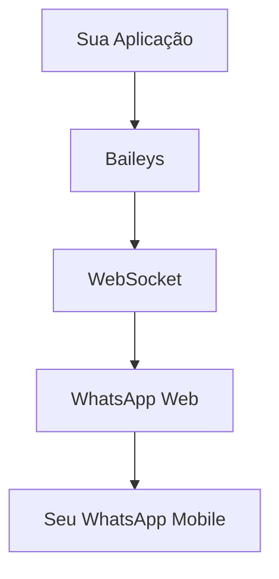

# 🚀 Baileys - Guia Completo e Didático

<div align='center'>


**A API WhatsApp Web mais completa em TypeScript/JavaScript**

[](https://github.com/brunocgc/Baileys)
[](https://www.npmjs.com/package/@brunocgc/baileys)
[](https://discord.gg/WeJM5FP9GG)

</div>

---

## 📋 Índice

- [🎯 O que é o Baileys?](#-o-que-é-o-baileys)
- [⚡ Início Rápido](#-início-rápido)
- [🔧 Instalação Detalhada](#-instalação-detalhada)
- [🏗️ Configuração Básica](#️-configuração-básica)
- [📱 Conectando sua Conta](#-conectando-sua-conta)
- [📨 Enviando Mensagens](#-enviando-mensagens)
- [🎯 Casos de Uso Práticos](#-casos-de-uso-práticos)
- [🛠️ Configurações Avançadas](#️-configurações-avançadas)
- [🔍 Solução de Problemas](#-solução-de-problemas)
- [📚 Recursos Adicionais](#-recursos-adicionais)

---

## 🎯 O que é o Baileys?

O **Baileys** é uma biblioteca JavaScript/TypeScript que permite interagir com o WhatsApp Web de forma programática, sem precisar do Selenium ou navegadores pesados.

### ✨ Principais Vantagens

- 🚫 **Sem Selenium**: Conexão direta via WebSocket
- 💾 **Economia de RAM**: ~500MB a menos de uso de memória
- 🔄 **Multi-dispositivo**: Suporte completo ao WhatsApp Multi-Device
- 📱 **QR Code ou Código**: Duas formas de autenticação
- 🔒 **Seguro**: Implementação completa do protocolo Signal

### 🏗️ Arquitetura



---

## ⚡ Início Rápido

### 1️⃣ Instalação

```bash
# NPM
npm install @brunocgc/baileys

# Yarn
yarn add @brunocgc/baileys

# PNPM
pnpm add @brunocgc/baileys
```

### 2️⃣ Primeiro Código

```typescript
import makeWASocket, { DisconnectReason, useMultiFileAuthState } from '@brunocgc/baileys'

async function startBot() {
    // 1. Configurar autenticação
    const { state, saveCreds } = await useMultiFileAuthState('auth_info')

    // 2. Criar conexão
    const sock = makeWASocket({
        auth: state,
        printQRInTerminal: true
    })

    // 3. Salvar credenciais
    sock.ev.on('creds.update', saveCreds)

    // 4. Escutar mensagens
    sock.ev.on('messages.upsert', ({ messages }) => {
        const msg = messages[0]
        if (!msg.key.fromMe && msg.message) {
            console.log('Nova mensagem:', msg.message)

            // Responder automaticamente
            sock.sendMessage(msg.key.remoteJid!, {
                text: 'Olá! Sou um bot feito com Baileys!'
            })
        }
    })
}

startBot()
```

### 3️⃣ Executar

```bash
npx ts-node meu-bot.ts
```

**📱 Escaneie o QR Code que aparecerá no terminal com seu WhatsApp!**

---

## 🔧 Instalação Detalhada

### 📦 Gerenciadores de Pacotes

<details>
<summary><strong>NPM (Node Package Manager)</strong></summary>

```bash
# Versão estável
npm install @brunocgc/baileys

# Versão de desenvolvimento (últimas features)
npm install github:brunocgc/Baileys
```

</details>

<details>
<summary><strong>Yarn</strong></summary>

```bash
# Versão estável
yarn add @brunocgc/baileys

# Versão de desenvolvimento
yarn add github:brunocgc/Baileys
```

</details>

<details>
<summary><strong>PNPM</strong></summary>

```bash
# Versão estável
pnpm add @brunocgc/baileys

# Versão de desenvolvimento
pnpm add github:brunocgc/Baileys
```

</details>

### 🔧 Dependências Opcionais

Para funcionalidades extras, instale:

```bash
# Para thumbnails automáticos
npm install sharp
# ou
npm install jimp

# Para preview de links
npm install link-preview-js

# Para cache (recomendado para grupos)
npm install node-cache
```

---

## 🏗️ Configuração Básica

### 🎛️ Opções do Socket

```typescript
import makeWASocket, { Browsers } from '@brunocgc/baileys'

const sock = makeWASocket({
    // 🔐 Autenticação
    auth: state,

    // 📱 QR Code no terminal
    printQRInTerminal: true,

    // 🌐 Navegador (afeta histórico de mensagens)
    browser: Browsers.macOS('Meu Bot'),

    // 📚 Sincronizar histórico completo
    syncFullHistory: true,

    // 🔕 Não marcar como online automaticamente
    markOnlineOnConnect: false,

    // 📊 Logger personalizado
    logger: pino({ level: 'info' })
})
```

### 🎯 Configurações Recomendadas

<details>
<summary><strong>Para Bots de Produção</strong></summary>

```typescript
const sock = makeWASocket({
    auth: state,
    browser: Browsers.ubuntu('MeuBot'),
    markOnlineOnConnect: false,
    syncFullHistory: false,
    generateHighQualityLinkPreview: true,

    // Cache para grupos (melhora performance)
    cachedGroupMetadata: async (jid) => groupCache.get(jid),

    // Store para retry de mensagens
    getMessage: async (key) => await getMessageFromStore(key)
})
```

</details>

<details>
<summary><strong>Para Desenvolvimento</strong></summary>

```typescript
const sock = makeWASocket({
    auth: state,
    printQRInTerminal: true,
    logger: pino({ level: 'debug' }),
    browser: Browsers.macOS('Debug'),
    syncFullHistory: true
})
```

</details>

---

## 📱 Conectando sua Conta

### 🔍 Método 1: QR Code (Recomendado)

```typescript
import makeWASocket from '@brunocgc/baileys'

const sock = makeWASocket({
    printQRInTerminal: true,
    browser: Browsers.ubuntu('Meu App')
})

console.log('📱 Escaneie o QR Code acima com seu WhatsApp!')
```

**✅ Vantagens**: Mais estável, funciona sempre
**❌ Desvantagens**: Precisa escanear manualmente

### 📞 Método 2: Código de Pareamento

```typescript
import makeWASocket from '@brunocgc/baileys'

const sock = makeWASocket({
    printQRInTerminal: false
})

// ⏳ Aguardar evento QR antes de solicitar código
sock.ev.on('connection.update', async (update) => {
    if (update.qr && !sock.authState.creds.registered) {
        const phoneNumber = '5511999999999' // Seu número com código do país
        const code = await sock.requestPairingCode(phoneNumber)
        console.log(`🔢 Código de pareamento: ${code}`)
        console.log('📱 Digite este código no seu WhatsApp')
    }
})
```

**✅ Vantagens**: Não precisa escanear QR
**❌ Desvantagens**: Só funciona uma vez por número

### 🔄 Gerenciamento de Conexão

```typescript
import { Boom } from '@hapi/boom'

sock.ev.on('connection.update', (update) => {
    const { connection, lastDisconnect } = update

    if (connection === 'close') {
        const shouldReconnect = (lastDisconnect?.error as Boom)?.output?.statusCode !== DisconnectReason.loggedOut

        if (shouldReconnect) {
            console.log('🔄 Reconectando...')
            startBot() // Função que inicia o bot
        } else {
            console.log('🚪 Desconectado. Escaneie o QR novamente.')
        }
    } else if (connection === 'open') {
        console.log('✅ Conectado com sucesso!')
    }
})
```

---

## 📨 Enviando Mensagens

### 💬 Mensagens de Texto

```typescript
// Mensagem simples
await sock.sendMessage(jid, { text: 'Olá! 👋' })

// Com formatação
await sock.sendMessage(jid, {
    text: '*Negrito* _Itálico_ ~Riscado~ ```Código```'
})

// Menção
await sock.sendMessage(jid, {
    text: '@5511999999999 Olá!',
    mentions: ['5511999999999@s.whatsapp.net']
})
```

### 🖼️ Mensagens com Mídia

<details>
<summary><strong>📷 Imagens</strong></summary>

```typescript
import fs from 'fs'

// De arquivo local
await sock.sendMessage(jid, {
    image: fs.readFileSync('./imagem.jpg'),
    caption: 'Olha essa foto! 📸'
})

// De URL
await sock.sendMessage(jid, {
    image: { url: 'https://example.com/imagem.jpg' },
    caption: 'Imagem da internet 🌐'
})

// ViewOnce (visualização única)
await sock.sendMessage(jid, {
    image: { url: './foto.jpg' },
    viewOnce: true,
    caption: 'Esta foto se autodestrue! 💥'
})
```

</details>

<details>
<summary><strong>🎥 Vídeos</strong></summary>

```typescript
// Vídeo normal
await sock.sendMessage(jid, {
    video: fs.readFileSync('./video.mp4'),
    caption: 'Confira este vídeo! 🎬'
})

// Nota de vídeo (PTV)
await sock.sendMessage(jid, {
    video: { url: './video.mp4' },
    ptv: true // Personal Video Message
})

// GIF (na verdade é MP4 com flag)
await sock.sendMessage(jid, {
    video: fs.readFileSync('./animacao.mp4'),
    gifPlayback: true,
    caption: 'GIF animado! 🎭'
})
```

</details>

<details>
<summary><strong>🎵 Áudios</strong></summary>

```typescript
// Áudio normal
await sock.sendMessage(jid, {
    audio: { url: './audio.mp3' },
    mimetype: 'audio/mp4'
})

// Nota de voz (PTT)
await sock.sendMessage(jid, {
    audio: fs.readFileSync('./voice.ogg'),
    mimetype: 'audio/ogg; codecs=opus',
    ptt: true // Push To Talk
})
```

**💡 Dica**: Para áudios funcionarem em todos os dispositivos:
```bash
ffmpeg -i input.mp3 -avoid_negative_ts make_zero -ac 1 output.ogg
```

</details>

### 📋 Mensagens Interativas

<details>
<summary><strong>📝 Lista de Opções</strong></summary>

```typescript
await sock.sendMessage(jid, {
    listMessage: {
        title: 'Escolha uma opção',
        text: 'Selecione o que deseja fazer:',
        footerText: 'Powered by Baileys',
        buttonText: 'Ver Opções',
        sections: [{
            title: 'Menu Principal',
            rows: [
                { title: 'Opção 1', rowId: 'opt1', description: 'Primeira opção' },
                { title: 'Opção 2', rowId: 'opt2', description: 'Segunda opção' },
                { title: 'Ajuda', rowId: 'help', description: 'Obter ajuda' }
            ]
        }]
    }
})
```

</details>

<details>
<summary><strong>📊 Enquetes</strong></summary>

```typescript
await sock.sendMessage(jid, {
    poll: {
        name: 'Qual sua linguagem favorita?',
        values: ['JavaScript', 'TypeScript', 'Python', 'Java'],
        selectableCount: 1
    }
})
```

</details>

<details>
<summary><strong>📍 Localização</strong></summary>

```typescript
await sock.sendMessage(jid, {
    location: {
        degreesLatitude: -23.5505,
        degreesLongitude: -46.6333,
        name: 'São Paulo, Brasil',
        address: 'Centro de São Paulo'
    }
})
```

</details>

### 💌 Recursos Especiais

<details>
<summary><strong>↩️ Responder Mensagem</strong></summary>

```typescript
// message é a mensagem que você quer responder
await sock.sendMessage(jid,
    { text: 'Esta é uma resposta!' },
    { quoted: message }
)
```

</details>

<details>
<summary><strong>↪️ Encaminhar Mensagem</strong></summary>

```typescript
// message é a mensagem que você quer encaminhar
await sock.sendMessage(jid, { forward: message })
```

</details>

<details>
<summary><strong>😍 Reagir a Mensagem</strong></summary>

```typescript
await sock.sendMessage(jid, {
    react: {
        text: '❤️', // Emoji da reação
        key: message.key // Chave da mensagem
    }
})

// Remover reação
await sock.sendMessage(jid, {
    react: {
        text: '', // String vazia remove a reação
        key: message.key
    }
})
```

</details>

---

## 🎯 Casos de Uso Práticos

### 🤖 Bot de Atendimento Simples

```typescript
sock.ev.on('messages.upsert', async ({ messages }) => {
    for (const msg of messages) {
        if (msg.key.fromMe || !msg.message) continue

        const text = msg.message.conversation ||
                    msg.message.extendedTextMessage?.text || ''

        const jid = msg.key.remoteJid!

        switch (text.toLowerCase()) {
            case 'oi':
            case 'olá':
                await sock.sendMessage(jid, {
                    text: '👋 Olá! Como posso ajudar?\n\n' +
                          'Digite:\n' +
                          '• *info* - Informações\n' +
                          '• *ajuda* - Menu de ajuda\n' +
                          '• *contato* - Falar com humano'
                })
                break

            case 'info':
                await sock.sendMessage(jid, {
                    text: 'ℹ️ *Informações da Empresa*\n\n' +
                          '🕐 Horário: 8h às 18h\n' +
                          '📧 Email: contato@empresa.com\n' +
                          '📱 WhatsApp: (11) 99999-9999'
                })
                break

            case 'ajuda':
                await sock.sendMessage(jid, {
                    listMessage: {
                        title: 'Central de Ajuda',
                        text: 'Como posso te ajudar?',
                        buttonText: 'Ver Opções',
                        sections: [{
                            title: 'Atendimento',
                            rows: [
                                { title: 'Suporte Técnico', rowId: 'suporte' },
                                { title: 'Vendas', rowId: 'vendas' },
                                { title: 'Financeiro', rowId: 'financeiro' }
                            ]
                        }]
                    }
                })
                break

            default:
                await sock.sendMessage(jid, {
                    text: '🤔 Não entendi. Digite *ajuda* para ver as opções disponíveis.'
                })
        }
    }
})
```

### 📊 Sistema de Notificações

```typescript
class NotificationBot {
    private sock: any
    private subscribers: Set<string> = new Set()

    constructor(socket: any) {
        this.sock = socket
        this.setupEventHandlers()
    }

    private setupEventHandlers() {
        this.sock.ev.on('messages.upsert', async ({ messages }) => {
            for (const msg of messages) {
                if (msg.key.fromMe || !msg.message) continue

                const text = msg.message.conversation || ''
                const jid = msg.key.remoteJid!

                if (text === '/subscribe') {
                    this.subscribers.add(jid)
                    await this.sock.sendMessage(jid, {
                        text: '✅ Você foi inscrito nas notificações!'
                    })
                } else if (text === '/unsubscribe') {
                    this.subscribers.delete(jid)
                    await this.sock.sendMessage(jid, {
                        text: '❌ Você foi desinscrito das notificações.'
                    })
                }
            }
        })
    }

    async broadcastNotification(message: string) {
        for (const jid of this.subscribers) {
            try {
                await this.sock.sendMessage(jid, { text: `📢 ${message}` })
                await new Promise(resolve => setTimeout(resolve, 1000)) // Rate limiting
            } catch (error) {
                console.error(`Erro ao enviar para ${jid}:`, error)
            }
        }
    }
}

// Uso
const bot = new NotificationBot(sock)

// Enviar notificação para todos os inscritos
setInterval(() => {
    bot.broadcastNotification('Lembrete: Reunião em 10 minutos!')
}, 3600000) // A cada hora
```

### 💾 Download de Mídia

```typescript
import { downloadMediaMessage } from '@brunocgc/baileys'
import fs from 'fs'

sock.ev.on('messages.upsert', async ({ messages }) => {
    for (const msg of messages) {
        if (msg.key.fromMe) continue

        const messageType = Object.keys(msg.message || {})[0]

        if (['imageMessage', 'videoMessage', 'audioMessage'].includes(messageType)) {
            try {
                const buffer = await downloadMediaMessage(
                    msg,
                    'buffer',
                    {},
                    {
                        logger: console,
                        reuploadRequest: sock.updateMediaMessage
                    }
                )

                const extension = messageType === 'imageMessage' ? 'jpg' :
                                messageType === 'videoMessage' ? 'mp4' : 'mp3'

                const filename = `media_${Date.now()}.${extension}`
                fs.writeFileSync(`./downloads/${filename}`, buffer)

                await sock.sendMessage(msg.key.remoteJid!, {
                    text: `✅ Mídia salva como: ${filename}`
                })

            } catch (error) {
                console.error('Erro ao baixar mídia:', error)
            }
        }
    }
})
```

---

## 🛠️ Configurações Avançadas

### 🗄️ Sistema de Cache para Grupos

```typescript
import NodeCache from 'node-cache'

const groupCache = new NodeCache({
    stdTTL: 300, // 5 minutos
    useClones: false
})

const sock = makeWASocket({
    // Cache de metadados de grupo
    cachedGroupMetadata: async (jid) => {
        return groupCache.get(jid)
    },

    // Store para retry de mensagens
    getMessage: async (key) => {
        return await getMessageFromStore(key)
    }
})

// Atualizar cache quando grupo muda
sock.ev.on('groups.update', async ([event]) => {
    const metadata = await sock.groupMetadata(event.id)
    groupCache.set(event.id, metadata)
})

sock.ev.on('group-participants.update', async (event) => {
    const metadata = await sock.groupMetadata(event.id)
    groupCache.set(event.id, metadata)
})
```

### 🔐 Configurações de Privacidade

```typescript
// Configurar privacidade do perfil
await sock.updateLastSeenPrivacy('contacts') // 'all' | 'contacts' | 'contact_blacklist' | 'none'
await sock.updateOnlinePrivacy('all') // 'all' | 'match_last_seen'
await sock.updateProfilePicturePrivacy('contacts')
await sock.updateStatusPrivacy('contacts')
await sock.updateReadReceiptsPrivacy('all') // 'all' | 'none'
await sock.updateGroupsAddPrivacy('contacts') // 'all' | 'contacts' | 'contact_blacklist'

// Bloquear/desbloquear usuário
await sock.updateBlockStatus('5511999999999@s.whatsapp.net', 'block')
await sock.updateBlockStatus('5511999999999@s.whatsapp.net', 'unblock')

// Ver configurações atuais
const privacy = await sock.fetchPrivacySettings(true)
console.log('Configurações de privacidade:', privacy)
```

---

## 🔍 Solução de Problemas

### ❌ Problemas Comuns

<details>
<summary><strong>🔄 "Conexão fechando constantemente"</strong></summary>

**Possíveis causas**:
- WhatsApp deslogado no celular
- Muitas mensagens sendo enviadas rapidamente
- Erro de autenticação

**Soluções**:
```typescript
// 1. Verificar se ainda está logado
sock.ev.on('connection.update', (update) => {
    if (update.connection === 'close') {
        const reason = (update.lastDisconnect?.error as Boom)?.output?.statusCode

        if (reason === DisconnectReason.loggedOut) {
            console.log('❌ Você foi deslogado. Escaneie o QR novamente.')
            // Deletar arquivos de autenticação
            fs.rmSync('./auth_info', { recursive: true, force: true })
        }
    }
})

// 2. Implementar rate limiting
const messageQueue: Array<() => Promise<void>> = []
let isProcessing = false

async function processQueue() {
    if (isProcessing || messageQueue.length === 0) return
    isProcessing = true

    while (messageQueue.length > 0) {
        const task = messageQueue.shift()!
        await task()
        await new Promise(resolve => setTimeout(resolve, 1000)) // 1 segundo entre mensagens
    }

    isProcessing = false
}

function queueMessage(jid: string, content: any) {
    messageQueue.push(() => sock.sendMessage(jid, content))
    processQueue()
}
```

</details>

<details>
<summary><strong>📱 "QR Code não aparece"</strong></summary>

**Verificações**:
```typescript
// 1. Verificar se printQRInTerminal está habilitado
const sock = makeWASocket({
    printQRInTerminal: true, // Deve ser true
    browser: Browsers.ubuntu('MeuBot')
})

// 2. Escutar evento QR manualmente
sock.ev.on('connection.update', (update) => {
    if (update.qr) {
        console.log('📱 QR Code disponível!')
        // Você pode usar uma biblioteca para mostrar o QR em uma interface web
    }
})
```

</details>

<details>
<summary><strong>🖼️ "Erro ao enviar mídia"</strong></summary>

**Verificações**:
```typescript
// 1. Verificar se o arquivo existe
if (!fs.existsSync('./imagem.jpg')) {
    console.error('❌ Arquivo não encontrado')
    return
}

// 2. Verificar tamanho do arquivo (WhatsApp tem limite)
const stats = fs.statSync('./imagem.jpg')
if (stats.size > 16 * 1024 * 1024) { // 16MB
    console.error('❌ Arquivo muito grande')
    return
}

// 3. Usar try/catch
try {
    await sock.sendMessage(jid, {
        image: fs.readFileSync('./imagem.jpg'),
        caption: 'Teste'
    })
} catch (error) {
    console.error('Erro ao enviar imagem:', error)
}
```

</details>

### 🐛 Debug e Logs

```typescript
import pino from 'pino'

// Logger detalhado para debug
const logger = pino({
    level: 'debug',
    transport: {
        target: 'pino-pretty',
        options: {
            colorize: true,
            translateTime: true,
            ignore: 'pid,hostname'
        }
    }
})

const sock = makeWASocket({
    logger,
    printQRInTerminal: true
})

// Escutar todos os eventos para debug
sock.ev.on('connection.update', console.log)
sock.ev.on('creds.update', () => console.log('Credenciais atualizadas'))
sock.ev.on('messaging-history.set', ({ messages, isLatest }) => {
    console.log(`Histórico carregado: ${messages.length} mensagens (${isLatest ? 'completo' : 'parcial'})`)
})
```

---

## 📚 Recursos Adicionais

### 🔗 Links Úteis

- 🏠 **Site Oficial**: [nvngroup.com.br](https://www.nvngroup.com.br)
- 📦 **NPM Package**: [@brunocgc/baileys](https://www.npmjs.com/package/@brunocgc/baileys)
- 💻 **GitHub**: [brunocgc/Baileys](https://github.com/brunocgc/Baileys)

### 📋 Exemplos Completos

- [Bot de Atendimento](Example/example.ts)
- [Sistema de Notificações](#-sistema-de-notificações)
- [Download de Mídia](#-download-de-mídia)

### 🤝 Contribuição

O Baileys é um projeto open-source mantido pela comunidade.

**Código original por**: [@WhiskeySockets](https://github.com/WhiskeySockets)
**Fork mantido por**: [@brunocgc](https://github.com/brunocgc)

Para contribuir:
1. Fork o projeto
2. Crie uma branch para sua feature
3. Commit suas mudanças
4. Abra um Pull Request

### ⚖️ Licença e Responsabilidade

- 📄 **Licença**: GPL 3.0
- ⚠️ **Importante**: Use de forma responsável
- 🚫 **Não**: Spam, stalking ou uso malicioso
- ✅ **Sim**: Automação legítima e bots úteis

---

<div align='center'>

**🎉 Parabéns! Você agora tem todos os conhecimentos para criar bots incríveis com Baileys!**

[](https://github.com/brunocgc/Baileys)

**Feito com ❤️ pela comunidade NvN Group**

</div>
